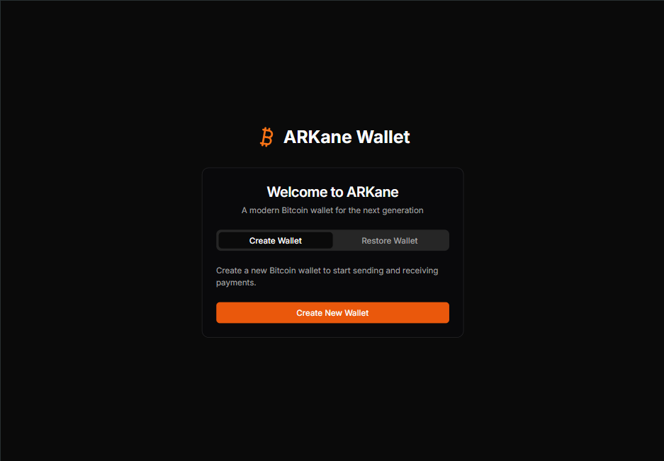
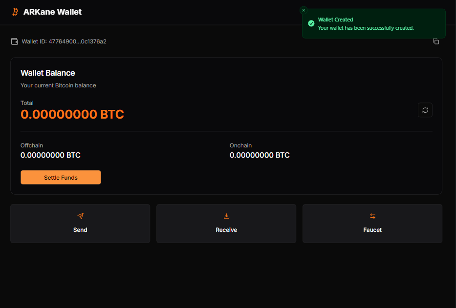
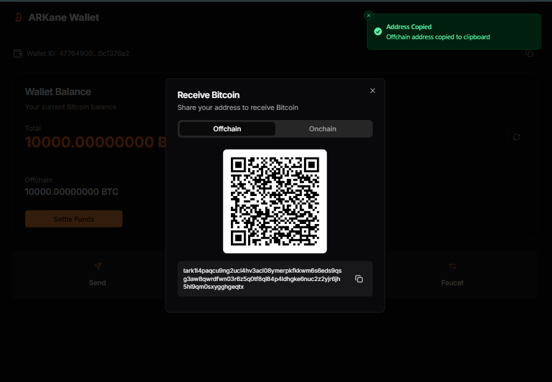
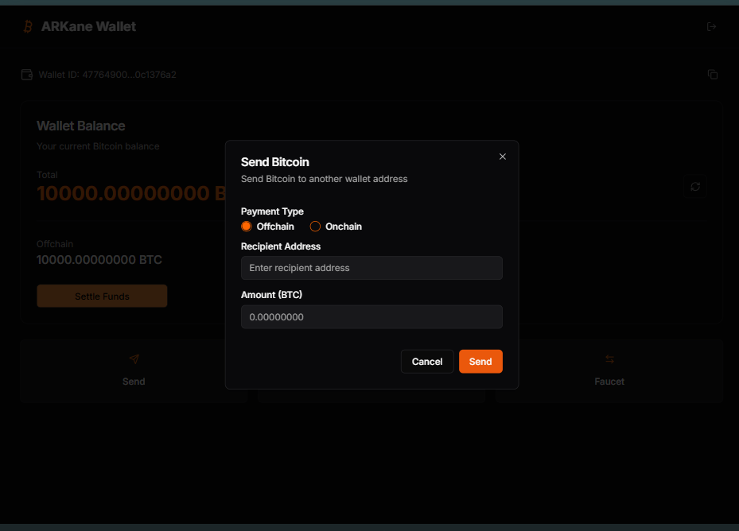

# ARKane Wallet : Ark based wallet
ARKane is a wallet implementation that allows you to create and manage Ark wallets, generate onchain and offchain addresses, and send funds to Ark addresses. It also includes a faucet functionality for requesting testnet bitcoin from the Nigiri Bitcoin testing environment.
This implementation is using `ark-core` crate to connect to ark network using grpc.
Reference taken from [ark-rs sample project](https://github.com/ArkLabsHQ/ark-rs/tree/master/ark-sample).


## Setup Instructions

### Prerequisites

- Rust and Cargo
- Node.js and npm
- [Nigiri](https://github.com/vulpemventures/nigiri) to quickly fire up a Bitcoin regtest environment and faucet funds.
- [Ark Server](https://arkdev.info/docs/quick-start/server) up running and funded.

### Backend Setup

1. Navigate to the backend server directory:

```bash
cd backend/server
```

2. Build the project:

```bash
cargo build
```

3. Run the server:

```bash
cargo run
```

The server will start on `127.0.0.1:8080`.

### Frontend Setup

1. Navigate to the frontend directory:

```bash
cd frontend
```

2. Install dependencies:

```bash
npm install
```

3. Start the development server:

```bash
npm run dev
```

The frontend will be accessible at the displayed URL (typically `http://localhost:3000`).

## API Endpoints

The backend server provides the following RESTful API endpoints:

- **POST /create_wallet**: Creates a new wallet and returns a wallet ID
- **GET /get_address/{wallet_id}**: Gets both onchain and offchain addresses for a wallet
- **GET /get_balance/{wallet_id}**: Gets wallet balances (offchain and boarding)
- **POST /faucet**: Requests testnet bitcoin from the faucet to an onchain address
- **POST /settle**: Settles funds from boarding outputs and VTXOs
- **POST /send_to_ark_address**: Sends funds to an Ark address

## Features

- Wallet creation and management
- Onchain and offchain address generation
- Balance checking across different states (spendable, expired, pending)
- Sending funds to Ark addresses
- Faucet integration for testing
- Settlement functionality to move funds between onchain and offchain

## Screenshots






